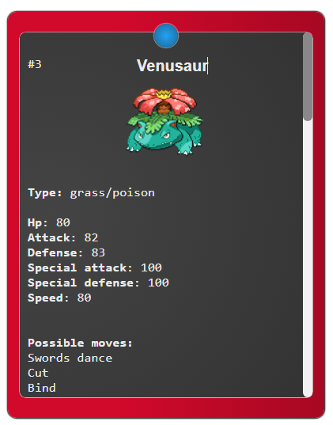

## A super simple pokedex
Made with react and empowered (not as much as possible) by PokeApi.

## How can i use it?
- Clone this repository:

		git clone https://github.com/gbrlbsls/simple-pokedex.git

Well... Now you have two paths:
		
- Install the packages:

		npm install
- Run the devserver:

		npm start

OR

- Run a http server on dist folder

		npx serve

## How does it look like?

As simple as

</img>

## How do i use it?
The blue button on the screeshot turns the pokedex on and off and the pokemon name is editable, there's no secret :)
